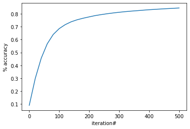

# digit_recognition_nn

a neural network created without using any frameworks. The network is tailored to work with the mnist data set, if you want to use it, you can download the set from here:  [link](https://www.kaggle.com/datasets/oddrationale/mnist-in-csv)

The network simply consists of 3 layers, input, hidden and output
zero layer: consists of 784 inputs [a 28x28 pixel image]
first layer: hidden layer and consists of 10 nodes
second layer: the output and consists of 10, one for the digits 0-9

The trainig steps:
* The network starts with a random guess for the weights and biases
* make a prediction through forward propagation using the weights and biases [Z = W.A + b]:
  * calculate first layer and apply a rectified linear unit (Relu) activation <- no longer linear
  * calculate second layer and apply a softmax activation function to get probabilities
* Apply a backwards propagation:
  * calculate error between prediction and actual value [dZ = A - Y]
  * calculate how much each weight and bias contribute to the error
  * update the weights and biases based on your learning rate alpha [hyper parameter]

results after 500 iterations:

iteration # 0 , Accuracy: 11.47 %\
iteration # 20 , Accuracy: 21.97 %\
iteration # 40 , Accuracy: 34.89 %\
iteration # 60 , Accuracy: 46.14 %\
iteration # 80 , Accuracy: 53.99 %\
iteration # 100 , Accuracy: 59.98 %\
iteration # 120 , Accuracy: 64.39 %\
iteration # 140 , Accuracy: 67.89 %\
iteration # 160 , Accuracy: 70.76 %\
iteration # 180 , Accuracy: 73.08 %\
iteration # 200 , Accuracy: 75.01 %\
iteration # 220 , Accuracy: 76.47 %\
iteration # 240 , Accuracy: 77.7 %\
iteration # 260 , Accuracy: 78.69 %\
iteration # 280 , Accuracy: 79.6 %\
iteration # 300 , Accuracy: 80.35 %\
iteration # 320 , Accuracy: 81.02 %\
iteration # 340 , Accuracy: 81.61 %\
iteration # 360 , Accuracy: 82.17 %\
iteration # 380 , Accuracy: 82.62 %\
iteration # 400 , Accuracy: 83.09 %\
iteration # 420 , Accuracy: 83.51 %\
iteration # 440 , Accuracy: 83.89 %\
iteration # 460 , Accuracy: 84.24 %\
iteration # 480 , Accuracy: 84.6 %\
iteration # 500 , Accuracy: 84.59 %

